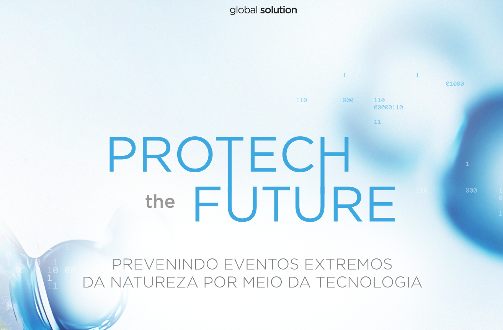
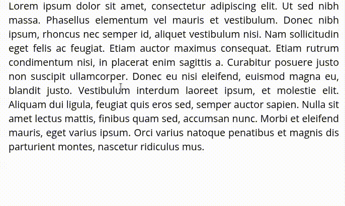

### 🚀 Estudante de Engenharia de Software | Python | Análise de Dados & IoT

<table style="width:100%; border-collapse: collapse; border: none;">
  <tbody>
    <tr>
      <td width="70%" valign="top" style="border: none; padding-right: 30px;">
        <h3>Olá, sou o Gabriel 👋</h3>
        

          Sou estudante de Engenharia de Software na FIAP, apaixonado por usar a tecnologia para resolver problemas reais e criar soluções de impacto.
        

        

          Meu foco principal é o desenvolvimento com Python, análise de dados e projetos de IoT. Estou sempre buscando aprender e aplicar novas tecnologias para construir projetos eficientes e escaláveis.
        

      </td>
      <td width="30%" valign="top" style="border: none;">
        
      </td>
    </tr>
  </tbody>
</table>

---

### 🛠 **Tecnologias e Ferramentas**

                

---

### 🏆 **Projetos em Destaque**

A seguir, alguns projetos que demonstram minhas habilidades na prática.

<table>
  <tr>
    <td width="65%">
      <h3>🏆 FIAP Global Solution 2025 - Protech The Future (1° Lugar)</h3>
      
Desenvolvemos um sistema de baixo custo para detecção e alerta de enchentes em tempo real, visando proteger comunidades vulneráveis. O projeto foi o vencedor da competição e contou com parcerias importantes como IBM, Médicos Sem Fronteiras, INPE e Defesa Civil.

       
      
🔗 <strong>GitHub:</strong> 
      <a href="https://github.com/rouri404/site-gs-fiap">github.com/rouri404/site-gs-fiap</a>

      
🛠️ <strong>Stack utilizada:</strong>

      <ul>
        <li><b>Hardware:</b> ESP32 + Sensores</li>
        <li><b>Backend:</b> Python, Django REST, MQTT</li>
        <li><b>Cloud:</b> Azure IoT</li>
        <li><b>Infra:</b> Docker</li>
        <li><b>Frontend:</b> TailwindCSS, Chart.js, Leaflet.js</li>
      </ul>
    </td>
    <td width="35%">
      
    </td>
  </tr>
</table>

---

<table>
  <tr>
    <td width="65%">
      <h3>🐧 GrabText - OCR para Linux</h3>
      
Uma ferramenta de produtividade que agiliza a captura de texto de qualquer lugar da tela. Seja de uma imagem, um vídeo ou uma página web, basta selecionar a área desejada para que o texto seja reconhecido e copiado instantaneamente.

       
      
🔗 <strong>GitHub:</strong> 
      <a href="https://github.com/rouri404/GrabText">github.com/rouri404/GrabText</a>

      
🛠️ <strong>Stack utilizada:</strong>

      <ul>
        <li><b>Linguagens:</b> Shell, Python</li>
        <li><b>Tecnologias:</b> Tesseract (OCR), Flameshot (Seleção de tela)</li>
        <li><b>Compatibilidade:</b> GNOME, XFCE, KDE Plasma</li>
      </ul>
    </td>
    <td width="35%">
       
    </td>
  </tr>
</table>

---

### 📬 **Vamos Conectar?**

* **LinkedIn**: [linkedin.com/in/gabricouto](https://linkedin.com/in/gabricouto)
* **GitHub**: [github.com/rouri404](https://github.com/rouri404)
* **E-mail**: [gabriel.couto2704@gmail.com](mailto:gabriel.couto2704@gmail.com)

---

  
  

